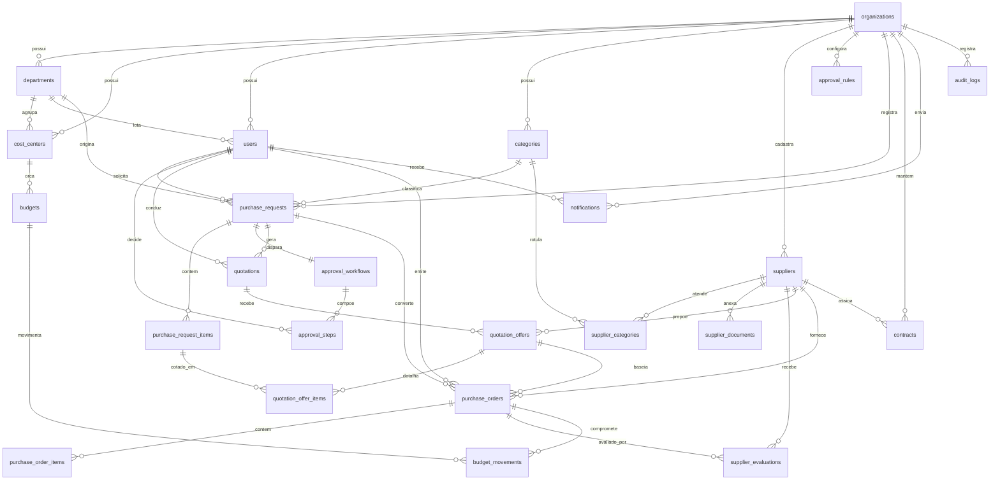

# Modelo de Dados - Diagrama Entidade-Relacionamento

Modelo físico completo em [`schema.sql`](schema.sql). Dados de demonstração em [`seed.sql`](seed.sql).

## Blocos funcionais

| Bloco | Tabelas | Papel |
|---|---|---|
| Estrutura organizacional | `organizations`, `departments`, `cost_centers`, `users`, `categories` | Base multiempresa e RBAC |
| Fornecedores | `suppliers`, `supplier_categories`, `supplier_documents`, `supplier_evaluations` | Cadastro, homologação, desempenho |
| Solicitações | `purchase_requests`, `purchase_request_items` | Registro da necessidade |
| Aprovação | `approval_rules`, `approval_workflows`, `approval_steps` | Motor de fluxo por alçada/nível |
| Cotação | `quotations`, `quotation_offers`, `quotation_offer_items` | Comparativo de propostas |
| Pedido | `purchase_orders`, `purchase_order_items` | Compromisso formal com fornecedor |
| Orçamento | `budgets`, `budget_movements`, `vw_budget_balance` | Planejado / comprometido / realizado |
| Contratos | `contracts` | Alertas de vencimento |
| Observabilidade | `notifications`, `audit_logs` | Alertas e trilha imutável |

## Regras de integridade relevantes

- **Auditoria**: `fn_audit()` grava `audit_logs` em `INSERT/UPDATE/DELETE` das tabelas transacionais, capturando `actor_id`/`client_ip` via `SET LOCAL app.current_user_id`.
- **Numeração**: sequências dedicadas geram `SC-*`, `COT-*`, `PC-*`.
- **Cotação vencedora única**: índice parcial `uq_quotation_single_selected` garante 1 `quotation_offers.is_selected` por cotação.
- **Saldo orçamentário**: `vw_budget_balance` deriva disponível de `budget_movements` (livro-razão append-only).
- **Rating de fornecedor**: `fn_supplier_rating()` recalcula `suppliers.rating_avg` a cada avaliação.
- **Totais de linha**: `line_total` é coluna `GENERATED ALWAYS AS ... STORED`.
